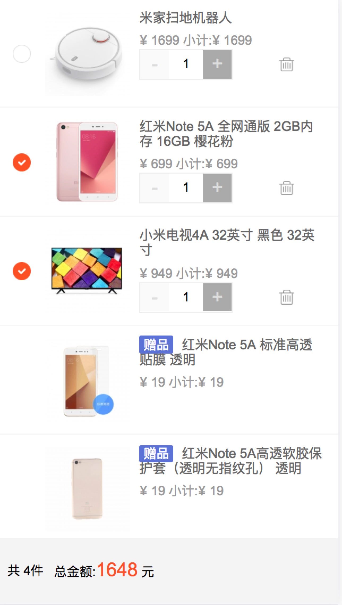

# 购物车：基于 Vue 2.5 + Vuex的练习

## Build Setup

``` bash
# install dependencies
npm install

# serve with hot reload at localhost:8080
npm run dev

# build for production with minification
npm run build

# build for production and view the bundle analyzer report
npm run build --report
```

For a detailed explanation on how things work, check out the [guide](http://vuejs-templates.github.io/webpack/) and [docs for vue-loader](http://vuejs.github.io/vue-loader).

### 主要目录

    ├── index.html
    ├── node_modules
    ├── package-lock.json
    ├── package.json
    ├── src
    │   ├── App.vue
    │   ├── assets
    │   │   ├── check_normal.png
    │   │   ├── check_press.png
    │   │   ├── logo.png
    │   │   └── trash.png
    │   ├── components
    │   │   ├── cart.less
    │   │   ├── component
    │   │   │   ├── bottom.vue
    │   │   │   ├── cartItem.vue
    │   │   │   └── inputnumber.vue
    │   │   └── index.vue
    │   ├── main.js
    │   ├── service
    │   │   ├── getCartData.js //异步请求数据
    │   │   └── mockData.js //模拟数据
    │   └── store
    │       ├── index.js
    │       └── utils.js
    └── static


#### 一些逻辑
- 购物车的 展示编辑 改变个数、选中状态、删除、等交互由 Vuex 来管理，并同步价格

#### 商品字段含义

    /**
    *{
    -    "buy_limit", 商品能购买的最大限制
    -    "goodsId", 商品唯一id
    -    "image_url", 图片链接
    -    "num": 1,  购买个数
    -    "price", 价格
    -    "product_name" 商品名称
    -    "sel_status", 选中状态: 0-未选中, 1:选中 
    -    "showType" 购买类型：buy-正常商品， gift-赠品
    -    "isdeleted" 是否已经被删除
    -    "parent_id" 只有赠品具有这个字段，该赠品对应正常购买的商品 goodsId
    *}
    */


